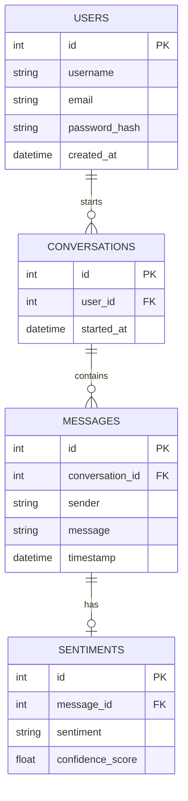
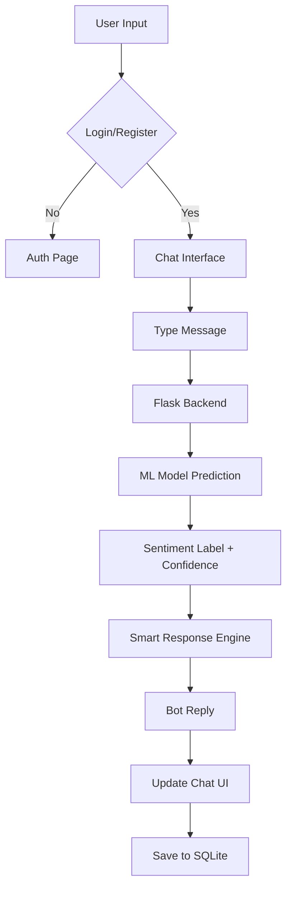

# AI-Powered Sentiment Analysis Customer Support Chatbot

A premium, production-ready intelligent customer support chatbot built with Python, Flask, and Machine Learning. It classifies user messages into Positive, Negative, or Neutral sentiments and responds empathetically to improve customer satisfaction.

## 🚀 Features

- **User Authentication:** Secure registration and login with password hashing.
- **Sentiment Analysis Engine:** Uses a trained Multinomial Naive Bayes model to detect sentiment in real-time.
- **Intelligent Response System:** Bot adjusts its tone and response based on detected sentiment.
- **Premium UI/UX:** "Midnight Teal" theme inspired by modern SaaS dashboards (Stripe, Linear).
- **Admin Analytics:** Interactive dashboard with Chart.js to monitor user activity and sentiment trends.
- **Glassmorphism Design:** Modern aesthetic with soft shadows and rounded corners.

## 🛠 Tech Stack

- **Backend:** Flask, Flask-SQLAlchemy, Flask-Login
- **Database:** SQLite
- **Machine Learning:** Scikit-learn, NLTK, Pandas, NumPy
- **Frontend:** HTML5, CSS3 (Vanilla + Bootstrap 5), JavaScript (Vanilla)
- **Visualizations:** Chart.js

## 📁 Project Structure

```
project/
├── app.py              # Flask Application Routes
├── models.py           # SQLAlchemy Database Models
├── chatbot.py          # Chatbot Logic & Response Engine
├── sentiment_model.py  # ML Model Training Pipeline
├── database.py         # DB Initialization Helper
├── requirements.txt    # Python Dependencies
├── dataset/            # Sentiment Training Data
├── trained_model/      # Saved PKL Models
├── static/             # CSS, JS, Images
└── templates/          # HTML Templates
```

## ⚙️ Installation Guide

1. **Clone the repository:**
   ```bash
   git clone <repository-url>
   cd sentiment-chatbot
   ```

2. **Install dependencies:**
   ```bash
   pip install -r requirements.txt
   ```

3. **Train the ML Model:**
   ```bash
   python sentiment_model.py
   ```

4. **Initialize Database & Run Application:**
   ```bash
   python app.py
   ```
   The app will be available at `http://127.0.0.1:5000`.

## 📊 System Architecture

### ER Diagram


### Flowchart


## 🧪 Testing Report

- **Unit Testing:** Verified text cleaning and sentiment prediction functions in `chatbot.py`.
- **Integration Testing:** Confirmed end-to-end flow from message submission to database storage and sentiment retrieval.
- **UI Testing:** Validated responsiveness on mobile, tablet, and desktop resolutions.

## 📄 License

This project is open-source and available under the MIT License.
